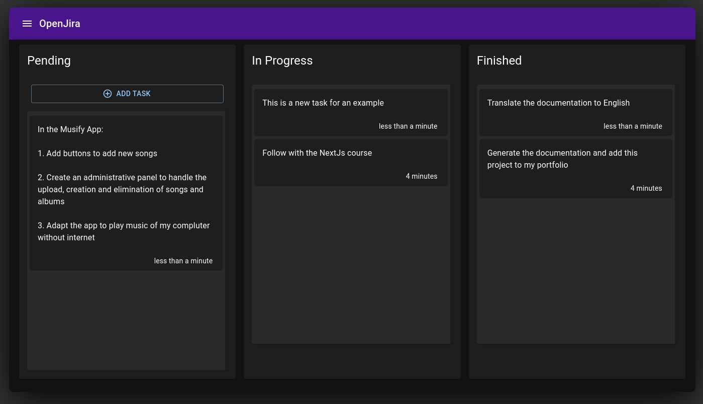

# Next.js OpenJira App ✍


### Screenshot




## What can you do with Open Jira?

Open Jira is a small application built with __Next.js__ that allow us to manage own daly tasks

In the application you will be able to:
- Build tasks and group them in three columns (_Pending_, _In Progress_ and _Complete_) with the target to have a control of your progress
- Edit created task 
- Delete tasks
- Move a task between columns
# See application

The application in production can be seen [here](https://open-jira-nextapp.netlify.app/)

To run the app in development, you must run the __mongodb docker image__

```
docker-compose up -d
```

* url local of mongodb

```
mongodb://localhost:27017/entriesdb
```


To generate the `build` of production

```bash
yarn build
```

To run the production version(`build`)

```bash
yarn start
```

## Environment variables

Rename the file __.env.template__ to __.env__

### Data of the variables

__DB_CNN__: String of conection with mongo

## Fill the database with test information

Call the endpoint:
```
GET http://localhost:3000/api/seed
```
